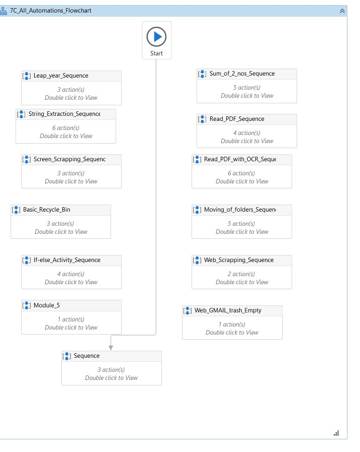

# RPA Automations

Robotic Process Automation (RPA) is a technology that allows organizations to automate repetitive and rule-based tasks by using software robots or "bots" to perform them. UiPath is one of the leading platforms for RPA, providing a comprehensive suite of tools for designing, deploying, and managing automation solutions.This Repository contains some of the basic automations done using UiPath.

## Tech Stack

**Robotic Process Automation Tool:** UiPath

**PIL:** It is used for Image Processing ,storing ,integration with Tkinter and Cross-platform Compatibility.

**OpenCv:** It is used for its efficient image handling, pixel-level access, versatile format support, visualization tools.

**OS:** It is used for path manipulation and interaction with OS system.

## Supported OS

1.Windows

## Authors

Rayees Hussain S A
 
